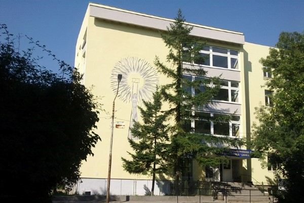

# 🧪 Himiq School - Periodic Table of Our School

A creative chemistry-themed website showcasing Himiq School through an innovative "Periodic Table of Our School" concept. Each school component (subjects, teachers, clubs, values, events, administration) is represented as an interactive periodic table element with unique chemistry connections.



## 🌟 Key Features

### 🔬 Virtual Chemistry Laboratory  
- **7+ Interactive Experiments** with real-time simulation
- **Experiment Types**: Combustion Analysis, Acid-Base Titration, Color Change Reactions, Electrolysis, Galvanic Cells, Polymer Synthesis, Chromatography
- **Advanced Controls**: pH monitoring, voltage control, spectrophotometer simulation
- **Educational Value**: Each experiment connects to real chemistry principles

### 🎨 Advanced UI/UX
- **Theme Toggle**: Dark/Light mode with localStorage persistence
- **Modal System**: Detailed element information with safety data sheets
- **Particle Effects**: Hover animations and smooth transitions  
- **Search Functionality**: Real-time debounced search across all elements
- **Multi-language Support**: English and Bulgarian translations

### 📱 Mobile Optimization
- **Touch-Friendly**: Optimized touch targets for mobile interaction
- **Responsive Grid**: Adapts from 5 columns (320px) to 18 columns (1400px+)
- **Performance**: Efficient rendering with CSS Grid and modern JavaScript
- **Accessibility**: ARIA labels, keyboard navigation, high contrast support

## 🚀 Technology Stack

- **Frontend**: HTML5, CSS3, Vanilla JavaScript (ES6+)
- **Styling**: CSS Grid, Flexbox, Custom Properties (CSS Variables)
- **Animations**: CSS Keyframes, Transform Transitions, Particle Effects
- **Storage**: localStorage for theme and language persistence  
- **Build**: No build process - pure vanilla web technologies
- **Server**: Python HTTP server for development

## 📂 Project Structure

```
/
├── index.html              # Main homepage with periodic table
├── about.html              # School information and timeline  
├── experiments.html        # Virtual chemistry laboratory
├── contact.html            # Contact forms and department info
├── admin.html              # Administrative interface
├── README.md               # Project documentation
├── css/
│   ├── style.css           # Core styling and layout
│   ├── periodic-table.css  # Periodic table specific styles
│   ├── modal.css           # Modal dialog styles
│   ├── footer.css          # Footer component styles
│   ├── controls.css        # UI controls and forms
│   └── notifications.css   # Toast notifications
├── js/
│   ├── main.js             # Core application logic
│   ├── experiments.js      # Laboratory simulation system
│   ├── language.js         # Multi-language support
│   ├── periodic-table.js   # Table rendering and interactions
│   └── utilities.js        # Helper functions
├── data/
│   ├── school-data.json    # Complete school elements database
│   ├── elements.json       # Additional element properties  
│   ├── schedule.json       # Class schedules (if applicable)
│   └── admin-config.json   # Administrative configuration
└── pics/
    └── shcool_pic.jpg      # School imagery
```

## 🐛 Known Bugs
- Mobile support doesn't work (Fixing Process)

## 🛠️ Installation & Setup

### Prerequisites
- **Python 3.x** (for development server)
- **Modern Web Browser** (Chrome 90+, Firefox 88+, Safari 14+)
- **Text Editor** (VS Code recommended)

### Quick Start

1. **Clone the Repository**
```bash
git clone https://github.com/SPGE-DNA/SPGE-Elements.git
cd SPGE-Elements
```

2. **Start Development Server**
```bash
python -m http.server 8000
```

3. **Open in Browser**
```
http://localhost:8000
```

### VS Code Setup
1. Install **Live Server** extension
2. Right-click `index.html` → "Open with Live Server"
3. Automatic browser refresh on file changes

## 🎯 Usage Guide

### Periodic Table Navigation
- **Click Elements**: View detailed information in modal dialog
- **Search**: Real-time search by element name or symbol  
- **Categories**: Filter by Science, Humanities, Sports, Technology, etc.
- **Theme Toggle**: Switch between dark and light modes
- **Language**: Toggle between English and Bulgarian

### Virtual Laboratory
1. Navigate to **Experiments** page
2. Choose from 7+ available experiments
3. Adjust parameters using interactive controls
4. Observe real-time chemical simulations
5. Record results and analyze data

### Mobile Experience  
- **Responsive Grid**: Automatically adapts to screen size
- **Touch Optimized**: Large touch targets for easy interaction
- **Swipe Navigation**: Smooth scrolling and transitions
- **Performance**: Optimized for mobile browsers

## 🧬 Element Data Structure

Each school element follows this chemistry-inspired structure:

```json
{
  "id": 1,
  "symbol": "Ch",
  "name": "Chemistry", 
  "nameBg": "Химия",
  "category": "science",
  "gridPosition": { "row": 2, "column": 1 },
  "description": "The central science connecting physics and biology",
  "chemistryRelation": "The heart of all molecular transformations - where atoms dance and bonds form the symphony of matter."
}
```

## 🎨 Styling Architecture

### CSS Custom Properties (Variables)
```css
:root {
  --science: #ff4757;      /* Red for science subjects */
  --humanities: #3742fa;   /* Blue for languages/arts */
  --sports: #2ed573;       /* Green for sports/activities */
  --technology: #00d4ff;   /* Cyan for technology subjects */
  --values: #ffa502;       /* Orange for school values */
  --events: #a55eea;       /* Purple for events/clubs */
  --admin: #747d8c;        /* Gray for administration */
}
```

### Responsive Breakpoints
- **1400px+**: Full 18-column desktop layout
- **1200px**: Compressed desktop (16-18 columns)  
- **1024px**: Large tablet (14-16 columns)
- **768px**: Small tablet (10-12 columns)
- **600px**: Large phone (8-10 columns)
- **480px**: Medium phone (6-8 columns)
- **375px**: Small phone (5-6 columns)
- **320px**: Extra small phone (4-5 columns)


## 📱 Browser Support

### Desktop
- **Chrome/Edge**: 90+ ✅
- **Firefox**: 88+ ✅  
- **Safari**: 14+ ✅ (with vendor prefixes)
- **Opera**: 76+ ✅

### Mobile
- **iOS Safari**: 14+ ❌
- **Chrome Mobile**: 90+ ❌
- **Samsung Internet**: 14+ ❌
- **Firefox Mobile**: 88+ ❌

## 🤝 Contributing

### Contribution Guidelines
1. **Fork the repository**
2. **Create feature branch** (`git checkout -b feature/amazing-feature`)
3. **Commit changes** (`git commit -m 'Add amazing feature'`)
4. **Push to branch** (`git push origin feature/amazing-feature`)
5. **Open Pull Request**

### Code Style
- **JavaScript**: ES6+ features, modern syntax
- **CSS**: BEM-like naming, mobile-first approach  
- **HTML**: Semantic structure, accessibility focus
- **Comments**: Descriptive, chemistry-themed where appropriate

## 📚 Educational Value

### Chemistry Learning Outcomes
- **Periodic Table**: Understanding element organization and properties
- **Chemical Bonds**: Visualizing molecular interactions through school connections
- **Laboratory Skills**: Virtual experiments develop practical chemistry knowledge
- **Real-World Applications**: Chemistry concepts applied to school environment

### Interdisciplinary Connections
- **Mathematics**: Stoichiometry and chemical calculations
- **Physics**: Quantum chemistry and electron behavior
- **Biology**: Biochemistry and metabolic processes
- **Technology**: Computational chemistry and molecular modeling

## 🏆 Performance Metrics

### Lighthouse Scores (Target)
- **Performance**: 95+ 🟢
- **Accessibility**: 100 🟢  
- **Best Practices**: 100 🟢
- **SEO**: 95+ 🟢

### Technical Specifications
- **Load Time**: <2 seconds on 3G
- **Bundle Size**: No build step required
- **Memory Usage**: <50MB typical
- **CPU Usage**: Minimal, optimized animations


## 📄 License

This project is licensed under the **MIT License** & **Apache License** - see the [LICENSE](LICENSE) file for details.

## 🙏 Acknowledgments

- **Periodic Table Design**: Inspired by the International Union of Pure and Applied Chemistry (IUPAC)
- **Chemistry Education**: Thanks to our chemistry teachers and consultants
- **Web Technologies**: Built with modern web standards and best practices
- **Community**: Special thanks to all contributors and beta testers

---

**Made with ❤️ and ⚗️ by the SPGE-DNK Development Team**

*"Where Chemistry Meets Innovation - Every Element Tells a Story"*